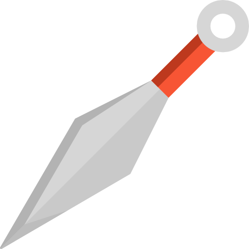

  
  <h4 >strong rabbit shall greeting you 🥕</h4>

#### you can explore here! 🔥

    <a href="https://rolling-scopes-school.github.io/sosukii-JSFE2023Q1/minesweeper/" target="_blanc">
        Saper
    </a> - saper game, theme (pink \ purple), win \ lose, broken herts, flags, sounds 🥕
     
    <a href="https://sosukii.github.io/virtual-keyboard/" target="_blanc">
        Keyboard
    </a> - virtual keyboard, mechanical-pink with textarea
     
    <a href="https://rolling-scopes-school.github.io/sosukii-JSFE2023Q1/shelter/" target="_blanc">
        Shelter
    </a> - <strong>adaptive, semanthic</strong> site for find a house to pets with <strong>pop-up, carousel and pagination</strong>
     
    <a href="https://rolling-scopes-school.github.io/sosukii-JSFEPRESCHOOL2022Q4/momentum/" target="_blanc">
        Naruto Momentum
    </a> - <strong>custom</strong> version of popular extension
     
    <a href="https://sosukii.github.io/cssBayan/cssBayan/index.html" target="_blanc">
        SpongeBob MemPants
    </a> - pack of mem with <strong>pure css</strong>
     
    <a href="https://rolling-scopes-school.github.io/sosukii-JSFEPRESCHOOL2022Q4/plants/" target="_blanc">
        Plants
    </a> - <strong>adaptive, semanthic, dropdown, blur option</strong> at plants care landing
     
    <a href="https://rolling-scopes-school.github.io/sosukii-JSFEPRESCHOOL2022Q2/travel/" target="_blanc">
        Travel
    </a> - landing for choose traveling place
     
    <a href="https://sosukii.github.io/sushi/" style="font-size: 16px;" target="_blanc">
        Sushi
    </a> - responsive page with products, desktop -> mobile
     
    <a href="https://sosukii.github.io/slider/" style="font-size: 16px;" target="_blanc">
        Slider base
    </a> responsive slider, next on arrow click, on circle click
     
    <a href="https://sosukii.github.io/travelSlider/" style="font-size: 16px;" target="_blanc">
        Slider complex
    </a> - responsive slider, next on arrow click, on circle click, on picture click

